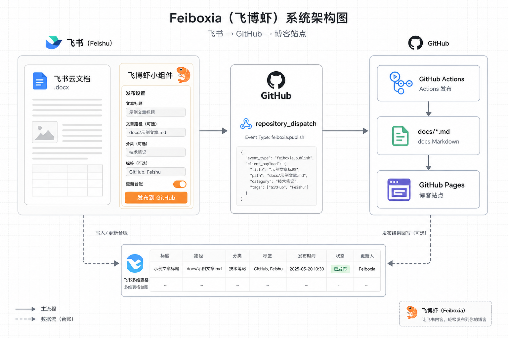
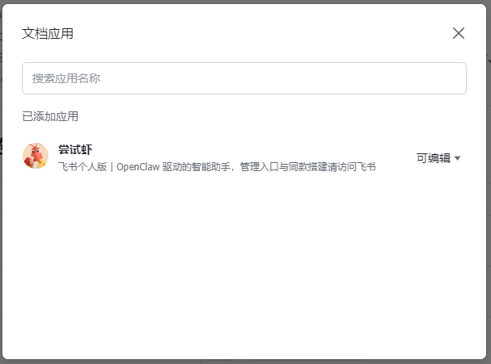
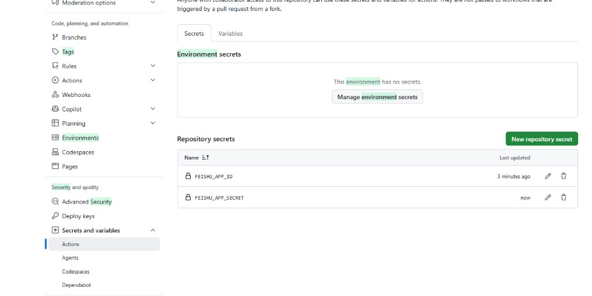
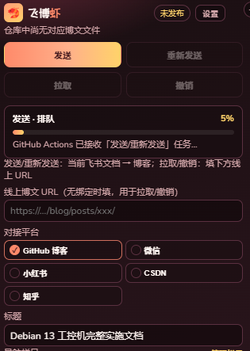
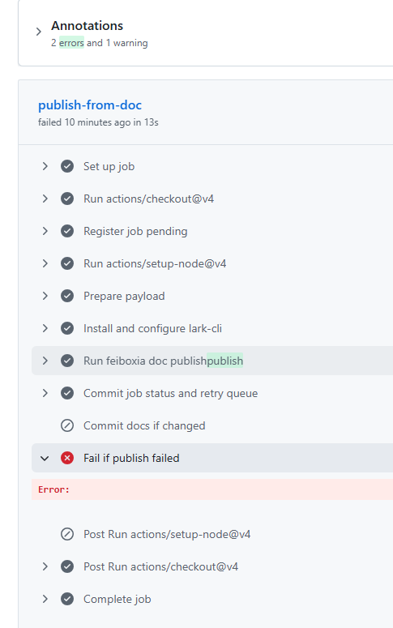
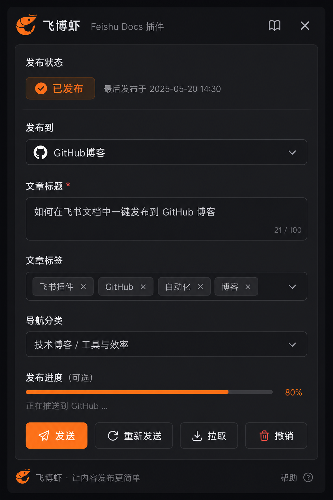

这篇不是「官方文档复读」，而是我把「飞书里写的文章，一点按钮就进 GitHub Pages」这件事做通之后，按真实顺序写下来的开发笔记。中间走错的路、报错原文、以及最后为什么又能通了，都写在一起——你照着做，至少少绕两周。

目标形态很简单：在任意飞书云文档里插入一个叫「飞博虾」的小组件，填标题 / 栏目 / 标签，点「发送」，GitHub Actions 自动拉正文、写 docs/、更新台账，博客上线。不需要自己架公网 Webhook。

【插图】飞博虾整体架构示意

---

## 1. 先分清三个容易混的概念

动手前先把名词对齐，否则开放平台里你会搜半天都不知道自己在配什么。

名字

它是什么

在飞博虾里叫啥

飞书应用（App）

开放平台上的主体，有 App ID / Secret

我们后台叫「尝试虾」，ID：cli_aaac9ff9eae4dbfc

云文档小组件（Docs Addon / Block）

挂在应用下的一种能力，能插入到文档侧栏

文档里搜到的名字叫「飞博虾」

机器人 / OpenAPI 身份

用 tenant_access_token 调接口

Actions 里拉正文、写多维表格用的就是它

关键点：小组件名字 ≠ 应用名字。
文档「添加文档应用」里要搜的是应用名「尝试虾」，不是「飞博虾」。我第一次按小组件名字搜，怎么都加不上——不是权限坏了，是搜错词了。

相关入口：

- 开放平台应用列表：https://open.feishu.cn/app

- 本应用后台：https://open.feishu.cn/app/cli_aaac9ff9eae4dbfc

- 小组件管理：https://open.feishu.cn/app/cli_aaac9ff9eae4dbfc/blocks/

- 官方「如何给应用加文档权限」：https://open.feishu.cn/document/faq/trouble-shooting/how-to-add-permissions-to-app

---

## 2. 飞博虾整体架构（你要搭的其实是这条链）

```

```

仓库里对应关系大致是：

层级

路径

职责

小组件前端

feiboxia/docs-addon/

React 面板、触发 dispatch、轮询 job

发布脚本

feiboxia/ci-doc-publish.mjs

拉正文、写 Markdown、写台账、写 job 状态

工作流

.github/workflows/feiboxia-doc-publish.yml

checkout → 跑脚本 → commit docs

任务状态

feiboxia/queue/jobs/{job_id}.json

给面板看进度（pending / running / success / failure）

绑定表

sync/feishu-map.json

docToken ↔ 博文路径

台账

飞书多维表格

「待发 / 已发」稿件箱

本机还有一条备用链路：npm run feiboxia:ship / npm run from-feishu——用 用户身份 拉文档，不依赖「文档已分享给应用」。CI 挂了时，它是救命绳。

---

## 3. 一次性后台：开应用能力与权限

### 3.1 创建 / 选中应用

在 飞书开放平台 创建企业自建应用（个人版也能玩一截），记下：

- App ID：形如 cli_xxxx

- App Secret：只出现一次，进密码管理器

### 3.2 添加「云文档小组件」能力

应用后台 → 添加应用能力 → 勾选 云文档小组件 → 创建 Block，拿到 blockTypeID（blk_...）。

把 feiboxia/docs-addon/app.json 里的占位符换成真实 ID，否则本地能跑、上传也怪。

### 3.3 开通 API 权限（踩坑重灾区）

至少要有这些（按你实际接口再加减）：

用途

典型 scope

读云文档正文

docx:document:readonly、docs:document.content:read

下载文档图片

drive:file:download、docs:document.media:download

写多维表格台账

bitable:app 或 base:record:create / base:record:update

（可选）发通知

im:message

开通权限 ≠ 立刻可用。 你还要：

1. 在「版本管理与发布」里 创建版本并发布

1. 确认 可用范围 包含你自己（文档所有者）

1. 否则「添加文档应用」弹窗里 搜不到你的应用

飞书报错 99991672 基本就是 scope 没开或没发布。申请链接会直接带在错误里，类似：

https://open.feishu.cn/app/<你的AppId>/auth?q=bitable:app,base:record:create&op_from=openapi&token_type=tenant

### 3.4 文档 / 台账要「添加文档应用」，不是普通「分享」

普通「分享」只能加人、加群。给 应用身份 授权的正确入口是：

文档右上角 「…」→「…更多」→「添加文档应用」 → 搜 应用名 → 权限至少「可阅读」（要改正文再给「可编辑」）。

【插图】真实截图：已添加「尝试虾」为文档应用

台账多维表格同理：也要给「尝试虾」可编辑，否则正文能写进博客，台账照样 99991672。

---

## 4. 小组件工程：本地开发与推送

工程在 feiboxia/docs-addon/，本质是飞书文档 Block + React + webpack。

### 4.1 日常命令

```

```

上传依赖 opdev CLI：

```

```

### 4.2 推送（上传）时真实踩过的坑

现象

真正原因

处理

Not login / get lark session failed

opdev 登录过期

重新 opdev login，与版本号无关

project.config.json is not found

自定义 webpack 没接官方插件

用 docsAddonWebpackPlugin 生成

Not allowed to upload

dist 空包 / 配置不全

先 build 再 upload，别手传空目录

改了代码文档里还是旧面板

后台版本没发布 / 文档缓存

开放平台创建新版本并设为可用，刷新文档

上传成功后控制台会给你小组件页链接；在后台填名称「飞博虾」、图标，再发布一版，文档 / 搜索才能稳定搜到。

面板大致长这样（深色、发送 / 重新发送 / 拉取 / 撤销）：

【插图】飞博虾小组件面板示意

---

## 5. GitHub 侧：Secrets、PAT、工作流

### 5.1 仓库 Secrets（Actions 用）

仓库 → Settings → Secrets and variables → Actions，至少：

Secret

用途

FEISHU_APP_ID

与开放平台一致

FEISHU_APP_SECRET

同上

（可选）FEISHU_NOTIFY_OPEN_ID

晚间重试失败时私聊通知

【插图】真实截图：已配置 FEISHU_APP_ID / SECRET

注意：Secrets 刚改完不会自动重跑旧任务，要再点一次小组件「发送」。

### 5.2 小组件里的 GitHub PAT

面板「设置」里填的 PAT 是 浏览器侧 用来：

- 调 repository_dispatch 触发工作流

- 读 Contents API 看博文在不在、轮询 feiboxia/queue/jobs/*.json

PAT 需要：repo + workflow（缺 workflow 时，dispatch 表面成功，Actions 永远不起）。

仓库默认推 main。我早期有一次推到了 master，Actions / Pages 盯的是 main，表现就是「任务一直排队」——其实远程根本没跑到你以为的那次提交。

### 5.3 工作流在干什么

.github/workflows/feiboxia-doc-publish.yml 核心步骤：

1. checkout

1. 注册 job pending（写队列 JSON 并 push）

1. 配置 lark-cli / 注入 FEISHU_*

1. node feiboxia/ci-doc-publish.mjs

1. 提交 job 状态；若成功再提交 docs/

1. 若发布逻辑失败 → Fail if publish failed 故意标红

所以你会看到一个很迷惑的画面：Run feiboxia doc publish 显示绿勾（开了 continue-on-error），后面 Fail if publish failed 红叉。请点开第 7 步日志看真实原因，不要只看红叉那一步。

【插图】真实截图：Fail if publish failed

---

## 6. 业务逻辑：发送时到底发生了什么

### 6.1 小组件

1. 读当前文档 token / 标题

1. 合并本地草稿（localStorage）与 Interaction，避免重开面板被飞书标题冲掉

1. repository_dispatch，带上 job_id、title、nav、slug、tags、doc_url…

1. 轮询：仓库里的 job JSON + Actions runs API

1. 成功则刷「已发布」；失败展示 message（现在会尽量带上飞书 API 原文）

### 6.2 CI 脚本 ci-doc-publish.mjs

拉正文优先级：

1. OpenAPI Blocks（含图片镜像到 docs/.../assets/）

1. lark-cli docs +fetch --as bot

1. OpenAPI raw_content 纯文本兜底

然后 buildPostMarkdown 写入 docs/{nav_dir}/{slug}.md，更新 feishu-map，再尝试 upsert 台账。

重要设计修正： 早期「台账一失败，整次 process.exit(1)」，导致日志里已经 ✓ 已写入 tech/xxx.md，但 Commit docs if changed 被跳过——博文写了却没进仓库。现在改成：正文成功则整体成功；台账失败只告警。

### 6.3 面板上的四个按钮

按钮

何时可用

含义

发送

仓库尚无对应博文

首次发布

重新发送

已有博文且已绑定本文档

覆盖更新

拉取

线上 URL 存在但未绑定本文档

把线上文绑到当前飞书文档

撤销

填了线上 URL 且文件存在

博客标 draft / 删绑定

---

## 7. 操作使用（给自己和协作者）

### 7.1 作者日常

1. 飞书写正文

1. / 插入「飞博虾」

1. 选栏目（如 tech）、填 slug / 标签、勾选 GitHub 博客

1. 点「发送」或「重新发送」

1. 看进度条；失败就点「Actions」看日志

博客地址规则：

https://duniang818.github.io/wahaha/{nav}/{slug}/
例如：https://duniang818.github.io/wahaha/tech/debian-ipc-setup/

### 7.2 本机救命命令

```

```

### 7.3 晚间重试

CI 拉正文失败时会进 sync/publish-retry-queue.json，北京时间 21:00 由「飞博虾·晚间重试」再跑。治本仍是：文档授权 + Secrets + scope。

---

## 8. 弯路与踩坑总结（请直接收藏）

下面按「症状 → 根因 → 怎么认」写，都是真撞过的墙。

### 坑 1：分享里搜不到「飞博虾」

- 根因： 普通分享不加应用；要搜的是应用名「尝试虾」。

- 入口： 「…更多」→「添加文档应用」。

- 还搜不到： scope 未开 / 版本未发布 / 可用范围不含你。

### 坑 2：Actions 一直「排队 5%」

常见叠加：

1. UI 把仓库里旧的 pending job 当成终态（已修轮询逻辑）

1. 推错分支（master vs main）

1. PAT 缺 workflow，根本没跑起来

1. 实际已经 failure，面板还显示排队

认法： 打开 Actions 看 conclusion；看 feiboxia/queue/jobs/*.json 的 message。

### 坑 3：日志已「✓ 已写入 md」，工作流仍红

- 根因： 写台账缺 bitable:app / base:record:create，旧逻辑把整次判失败，docs 未 commit。

- 处理： 开通并发布 bitable 权限；台账也「添加文档应用」；代码侧改为台账失败不阻断正文。

### 坑 4：文档授权了，CI 仍拉不到正文

对照清单：

- Secrets 是否是这对 App ID/Secret（别拷错应用）

- 授权的是不是当前这篇文档（token 要对）

- 个人版 / 权限延迟：改完再发一次

本机验证：

```

```

bot 能出正文，CI 才有戏。

### 坑 5：重开面板标题 / 标签被冲掉

飞书会重挂载小组件，Interaction 字段易丢。做法：

- localStorage 即时存草稿

- 空字段不覆盖已有草稿

- 发送中禁止 refreshStatus 把徽章刷成「未发布」

- 进行中任务把 draft 一并持久化，恢复时优先用任务草稿

### 坑 6：opdev 上传「以前的版本都行，这个版本不行」

多半是登录态掉了，不是业务代码突然不能传。先 opdev whoami。

### 坑 7：client_payload 字段太多

repository_dispatch 的 client_payload 最多约 10 个字段。台账 base_token / table_id 适合在 CI 里用默认值补，别全塞进 payload。

---

## 9. 推荐落地顺序（新环境照抄）

1. 建飞书应用，开云文档小组件，拿到 blockTypeID

1. 开文档 / 云空间 / 多维表格相关 scope，发一版并设可用范围

1. 配置 GitHub Secrets：FEISHU_APP_ID / FEISHU_APP_SECRET

1. opdev login → npm run upload → 后台发布小组件版本

1. 文档里插入「飞博虾」，设置里填仓库 + PAT（repo+workflow）

1. 对该文档「添加文档应用」→ 应用名（如尝试虾）→ 可阅读

1. 台账 Base 同样添加应用 → 可编辑

1. 点发送；失败就看 Actions 第 7 步日志，不要只看最后红叉

1. 仍不通时用本机 from-feishu --push 兜底，再回头修权限

---

## 10. 相关链接与仓库索引

说明

链接 / 路径

飞书开放平台

https://open.feishu.cn/app

尝试虾应用

https://open.feishu.cn/app/cli_aaac9ff9eae4dbfc

小组件后台

https://open.feishu.cn/app/cli_aaac9ff9eae4dbfc/blocks/

给应用加文档权限（官方）

https://open.feishu.cn/document/faq/trouble-shooting/how-to-add-permissions-to-app

99991672 排查

https://open.feishu.cn/document/uAjLw4CM/ugTN1YjL4UTN24CO1UjN/trouble-shooting/how-to-fix-the-99991672-error

博客工作台

https://duniang818.github.io/wahaha/feiboxia/workbench.html

小组件 README

feiboxia/docs-addon/README.md

发布工作流

.github/workflows/feiboxia-doc-publish.yml

飞书写作一键发博客

飞书写作 → 一键发布博客

---

写到这里，整条链对我已经「可预期」了：文档授权给应用、Secrets 配对、scope 发版、PAT 带 workflow、推 main。剩下的就只是业务功能迭代。

若你也在做同类「文档内一点发布」的产品，最想提醒一句——UI 上的红叉往往是结果，日志里那一行才是病因；而「搜不到应用」十有八九是搜错名字或版本没进可用范围。 这两点先查，能省掉大半无效重试。












